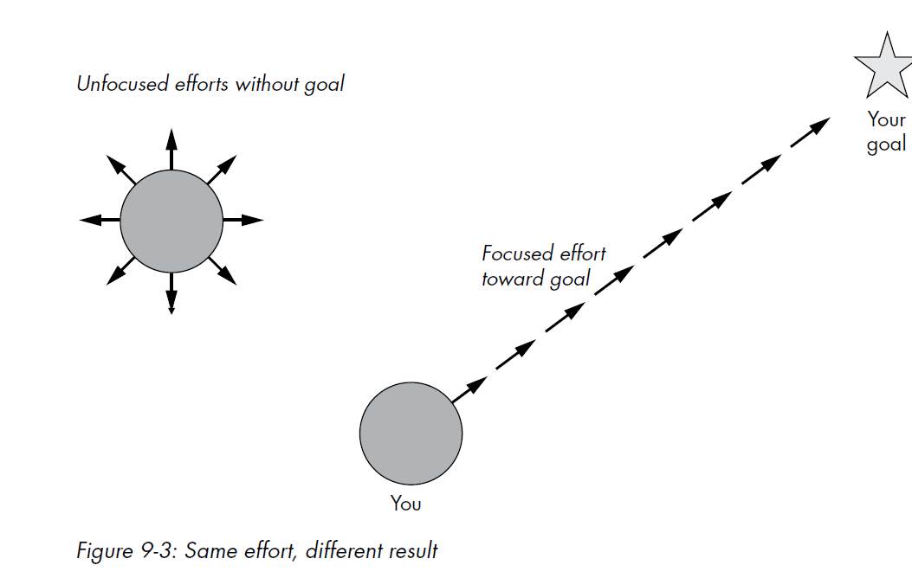

# Chapter 9: Focus

> The most important lesson in this book: how to focus.

## The Weapon Against Complexity

> The main thesis of this book is that complexity leads to chaos. Chaos is the
flip side of focus. To solve the challenges posed by complexity, you need to
use the powerful weapon of focus.

> Productivity means creating something. Then, to be productive,
you must reduce entropy.

*Figure 9-3: Same effort, different result — A great example of how the same amount of effort yields completely different outcomes depending on whether it is focused or scattered.*

## Unifying the Principles

> **The 80/20 Principle:**
Focus on the vital few: remember that 20 percent delivers 80 percent of
the results and ignore the trivial many, increasing your productivity by
one or two orders of magnitude.

> **Build a Minimal Viable Product:**
Focus on one hypothesis at a time, thereby reducing the complexity
of your product, reducing feature creep, and maximizing the rate of
progress toward product-market fit.

> **Write Clean and Simple Code:**
Complexity slows your understanding of the code and increases the
risk of errors.

> **Premature Optimization Is the Root of All Evil:**
Focus your optimization efforts where they matter.

> **Flow:**
Flow is a state in which you're completely involved in the task at hand—
you're focused and concentrated.

> **Do One Thing Well (Unix):**
The basic idea of the Unix philosophy is to build simple, clear, concise,
modular code that is easy to extend and maintain.

> **Less Is More in Design:**
Focus the user's attention on the unique value your product provides!

## Key Takeaway
Focus is the unifying thread of the entire book. Every principle—80/20, MVP, clean code, avoiding premature optimization, flow, Unix philosophy, and minimalist design—is ultimately about directing your limited energy toward what matters most. The same effort, when focused, produces dramatically better results than when scattered.
